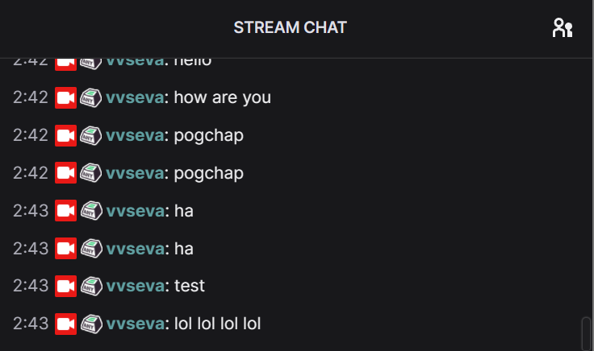

# twitch_sense

ok so that is a tiny project to proof an idea

with the help of twitch [IRC](https://dev.twitch.tv/docs/irc) that grab chat messages

stream them to a local server, (mongoDB db in my case)

than makes simple viz for the last 90 seconds on demand

while being wrapped into a shiny application
